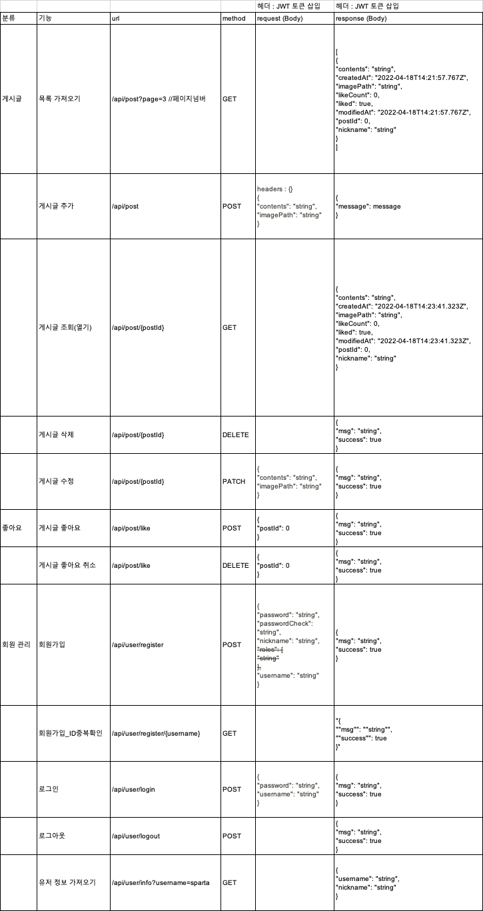

# 항해99 주특기 PBL 2-3주차 과제

### 🏁 **Goal:  "프론트엔드와 함께 로그인 사용자용 매거진 사이트 만들기"**

- 학습 과제를 끝내고 나면 할 수 있어요!
    1. 프론트엔드와 함께 협업할 수 있어요.
    2. 레이지 로딩, 이거 로딩이 무엇인 지 알고, ORM을 사용할 수 있어요.
    3. MySQL을 이용한 프로젝트를 구현할 수 있어요.

### 🚩 **Requirement:  과제에 요구되는 사항이에요**

- `과제 요구 사항`을 모두 완수해야 합니다!
<br>
<br>
    ✅ 과제 요구 사항


1. API List 를 프론트엔드와 논의하여 정하고, 그에 맞춰 구현하기
2. 회원 가입 페이지
트  - [x] 회원 가입을 구현할 때 인증 인가 방식은 자유롭게 선택해주시면 됩니다.
  - [x] 닉네임은 `최소 3자 이상, 알파벳 대소문자(a~z, A~Z), 숫자(0~9)`로 구성하기
  - [x] 비밀번호는 `최소 4자 이상이며, 닉네임과 같은 값이 포함된 경우 회원가입에 실패`로 만들기
  - [x] 비밀번호 확인은 비밀번호와 정확하게 일치하기

3. 로그인 페이지
   - [x] 로그인 버튼을 누른 경우 닉네임과 비밀번호가 데이터베이스에 등록됐는지 확인한 뒤, 하나라도 맞지 않는 정보가 있다면 "닉네임 또는 패스워드를 확인해주세요"라는 메세지를 프론트엔드에서 띄워줄 수 있도록 예외처리 하기

4. 로그인 검사
   - [x] 로그인 하지 않은 사용자도, 게시글 목록 조회는 가능하도록 하기
   - [x] 로그인하지 않은 사용자가 좋아요 버튼을 눌렀을 경우, "로그인이 필요합니다." 라는 메세지를 프론트엔드에서 띄워줄 수 있도록 예외처리 하기
   - [x] 로그인 한 사용자가 로그인 페이지 또는 회원가입 페이지에 접속한 경우 "이미 로그인이 되어있습니다."라는 메세지로 예외처리하기
   - 인증 인가를 어떤 개념(Token/Session)을 채택 했는지, 그 이유에 대해서 설명하기
```
    - jwt 학습을 위해 Token을 채택하였다.
   
    - 세션방식은 1차적으로 무상태성이 아니므로, 다중 서버에서 세션을 공유해야하는 로직이 필요로하다.
    
      하지만, 세션은 서버에서 사용자 인증 프로토콜을 손쉽게 조정할 수 있는 장점이 있다.

    - Token 방식은 무상태를 지킬수 있으며, 토큰에 사용자 인증 정보를 보관하기 떄문에,

      다중 서버 환경에서도 토큰을 받는 서버는 인증절차를 할 수 있어 로직을 간소화할 수 있다.

      다만, 토큰의 탈취에 인증시스템이 무방비하다. 탈취에 대한 별도의 로직이 필요한 이유이다.

      또한, 인증에 대한 제어권을 클라이언트/서버 모두 가지고 있으므로, 관리상 복잡한 로직이 필요하다.
```

5. CORS 해결하기
   - CORS란 무엇이며, 어떤 상황에서 일어나는지 / 어떻게 해결하는지 알아보고, 프로젝트에 적용하기
```
    - CORS는 현재시스템이 다른 시스템의 자원을 이용하는 것이다. 자원이라 함은.. 그냥 타 시스템의 서비스라 생각하면됩니다.
    
    - Spring Security에서는 Cors에 대한 옵션을 조정할 수 있다. [참고](https://www.baeldung.com/spring-cors)
    
        - CorsConfiguration 객체를 생성하여, 아래와 같이 설정한 다음. Web Security Configurer Adapter에 붙여두면된다.
        
           - addAllowedOrigin() : 허용할 출처
           
           - addAllowedHeader() : 허용할 헤더
           
           - addAllowedMethod() : 허용할 메서드
           
```


6. 좋아요 순 정렬(정렬하기는 꼭 해봐야 하는 건데 과제에 없다)
   - 정렬 기준 중 하나를 선택해주세요!
       - [x] 생성일 순
       - [ ] 좋아요 순
       - [ ] view 순

## ERD


## API 리스트




---
# Lv3. 테스트

- [테스트전략](https://www.popit.kr/spring-guide-%ED%85%8C%EC%8A%A4%ED%8C%85-%EC%A0%84%EB%9E%B5/)
- [유닛테스트](https://galid1.tistory.com/772)
- [통합테스트](https://galid1.tistory.com/735)


## - 과제 내용

- Unit test와 Integration test는 무엇이고, 어떻게 하는지 알아보기
- Integration test 시나리오 작성하기
    - 개발자의 관점이 아닌 고객 관점에서 작성해보세요!
- 서비스 레이어 테스트 코드 커버율 70% 이상 만들어오기

### - [4월23일 작업](개발일기/8일차.md)

